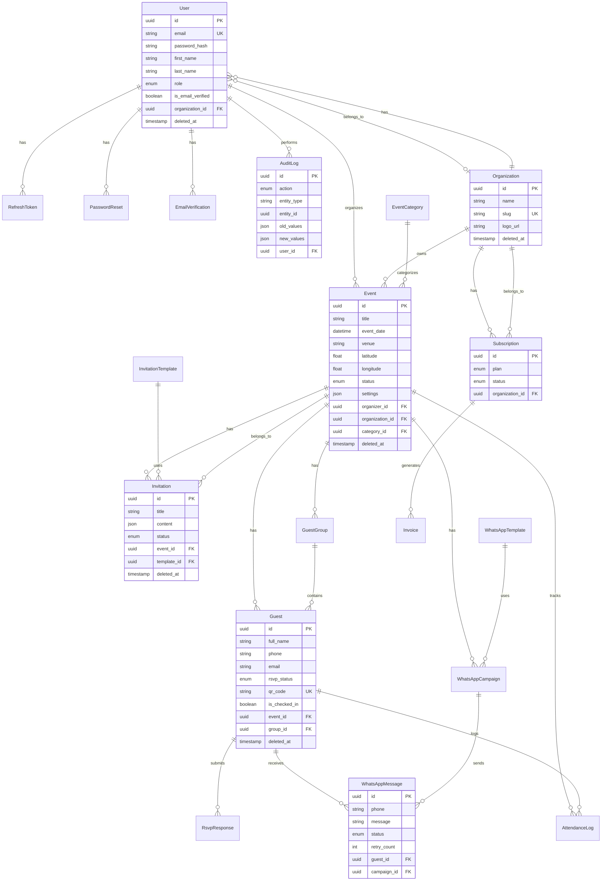

# EventFlow Database ERD

## Entity Relationship Diagram

## Relationships Summary

| Parent | Child | Type | On Delete |
|--------|-------|------|-----------|
| User | RefreshToken | 1:N | Cascade |
| User | Event | 1:N | Restrict |
| Organization | User | 1:N | Set Null |
| Organization | Event | 1:N | Set Null |
| Organization | Subscription | 1:N | Restrict |
| Event | Guest | 1:N | Cascade |
| Event | Invitation | 1:N | Cascade |
| Event | GuestGroup | 1:N | Cascade |
| Guest | RsvpResponse | 1:N | Cascade |
| Guest | WhatsAppMessage | 1:N | Cascade |
| Guest | AttendanceLog | 1:N | Cascade |
| Subscription | Invoice | 1:N | Restrict |

## Indexes

Critical indexes for query performance:

- `users.email` — login lookups
- `users.organization_id` — tenant scoping
- `events.organizer_id, events.status` — dashboard queries
- `events.event_date` — calendar views
- `guests.event_id, guests.rsvp_status` — RSVP analytics
- `guests.qr_code` — check-in scanning
- `whatsapp_messages.status` — delivery tracking
- `audit_logs.entity_type, entity_id` — audit queries
- `audit_logs.created_at` — time-range queries

## Soft Delete Strategy

Tables with `deleted_at`:
- users, organizations, events, guests, guest_groups
- invitations, invitation_templates, whatsapp_templates, whatsapp_campaigns

Soft-deleted records are excluded from all queries via repository base class.

## Audit Tables

`audit_logs` captures all mutations with:
- Actor (user_id)
- Action (CREATE, UPDATE, DELETE, etc.)
- Entity reference (type + id)
- Before/after JSON snapshots
- Request metadata (IP, user agent)
